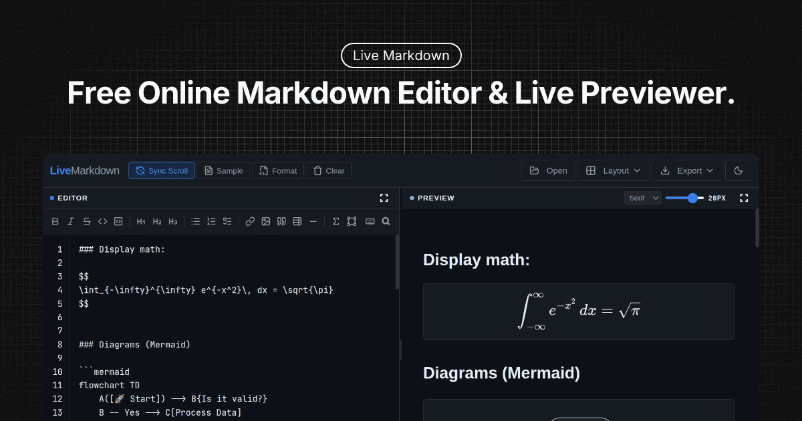

# Live Markdown

**LiveMarkdown** is a fast, free, and privacy-focused online Markdown editor with real-time preview. Built for developers, technical writers, and students, it provides a premium writing experience directly in your browser without the need for installation or account creation.



## Key Features

- **Live Previewing**: See your formatted document update in real-time with a smooth 120ms debounce.
- **Full Markdown Support**: GFM (GitHub Flavored Markdown) support via `marked.js`.
- **Advanced Syntax Highlighting**: Automatic highlighting for 100+ languages using `highlight.js`.
- **Math & Diagrams**:
  - **LaTeX Math**: Render complex equations with KaTeX (inline `$…$` and display `$$…$$`).
  - **Mermaid Diagrams**: Create flowcharts, sequence diagrams, and more using plain text.
- **Find & Replace**: Robust in-editor search with a dedicated background highlight layer and `Ctrl+F` support.
- **Export Options**: 
  - Download as `.md`
  - Export as self-contained `.html`
  - Print/Export to **PDF** via the browser's native print dialog.
- **User Experience**:
  - **4 Layout Modes**: Editor Left/Right/Top/Bottom options.
  - **Auto-save**: Content is automatically persisted locally in your browser.
  - **Drag & Drop**: Simply drop a `.md` or `.txt` file to start editing.
  - **Dark/Light Mode**: Seamlessly toggle between themes.
  - **Spell Check**: Built-in toggle to help catch errors.

## Tech Stack

- **Core**: Vanilla JavaScript (ES6+), HTML5, CSS3
- **Markdown Engine**: [Marked.js](https://marked.js.org/)
- **Syntax Highlighting**: [Highlight.js](https://highlightjs.org/)
- **Math Rendering**: [KaTeX](https://katex.org/)
- **Diagrams**: [Mermaid.js](https://mermaid-js.github.io/)
- **Design**: Premium custom CSS with a focus on typography (Inter, JetBrains Mono, Crimson Pro).

## Getting Started

LiveMarkdown is completely standalone. To run it locally:

1. Clone the repository:
   ```bash
   git clone https://github.com/forhadkhan/livemarkdown.git
   ```
2. Open `index.html` in any modern web browser.
3. No build step or dependencies are required!

## Keyboard Shortcuts

| Shortcut | Action |
| :--- | :--- |
| `Ctrl + F` | Open Find & Replace bar |
| `?` | Toggle Help/Shortcuts modal |
| `Esc` | Close dialogs / Exit fullscreen |
| `Tab` | Insert 2-space soft indent |

## Contributing

Contributions are welcome! Please feel free to submit a Pull Request.

1. Fork the Project
2. Create your Feature Branch (`git checkout -b feature/AmazingFeature`)
3. Commit your Changes (`git commit -m 'Add some AmazingFeature'`)
4. Push to the Branch (`git push origin feature/AmazingFeature`)
5. Open a Pull Request

## License

Distributed under the MIT License. See `LICENSE` for more information.

---

Built with ❤️ by [Forhad Khan](https://forhadkhan.com)

### Acknowledgments

This project was developed with the collaborative assistance of:
- **Claude 4.6 Sonnet** (Anthropic)
- **Gemini 3 Flash** (Google)
- **Antigravity** (Google)
